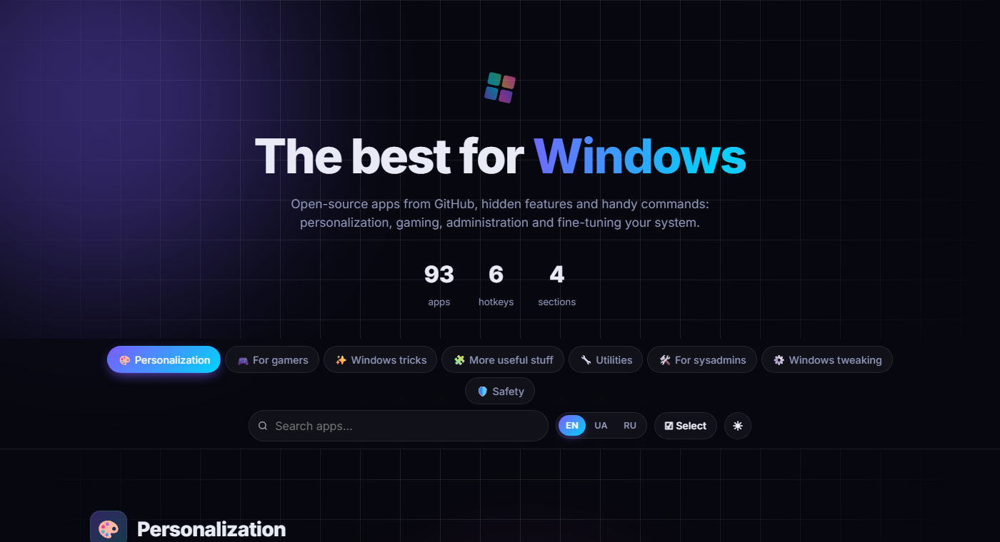
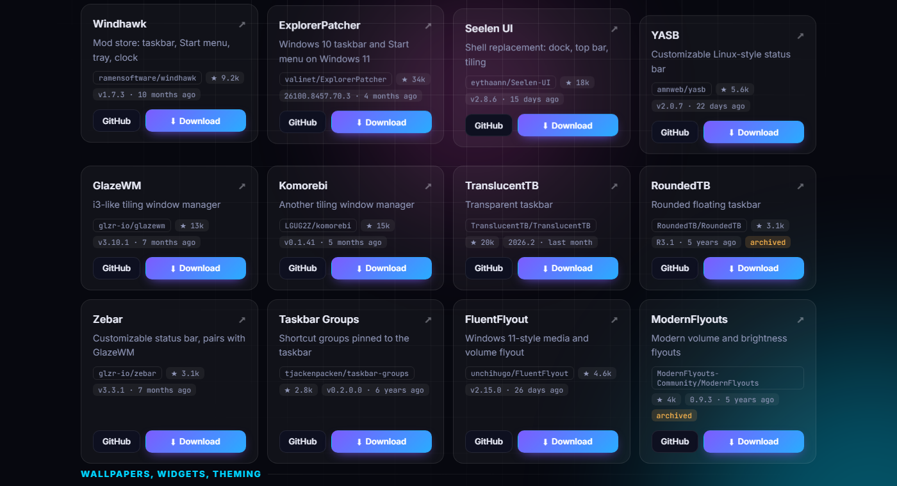

# Windows Toolbox

A catalog of free open-source apps for Windows: personalization, gaming, administration, system tweaking, plus built-in Windows tricks and handy commands. English, Ukrainian and Russian.

**[⬇ Download WindowsToolbox.exe](https://github.com/barnibeats/windows-toolbox-releases/releases/latest/download/WindowsToolbox.exe)** — portable, no installation. Requires the WebView2 Runtime (built into Windows 11; for Windows 10 [get it from Microsoft](https://go.microsoft.com/fwlink/p/?LinkId=2124703)).

- **One-click downloads.** Every app links straight to the Windows file of its latest release; links, stars and release dates are refreshed daily.
- **Install with winget.** In the app, apps available in winget install silently with one click; installed apps and available updates are marked.
- **Sets.** Pick several apps, install them all at once, save the set, share it as a link or export a PowerShell script.
- **Always up to date.** The catalog updates itself on every launch, and the app installs its own new versions when you close it.

---

**Українською.** Каталог безкоштовних програм з відкритим кодом для Windows: завантаження в один клік, встановлення через winget, набори програм. [Завантажити WindowsToolbox.exe](https://github.com/barnibeats/windows-toolbox-releases/releases/latest/download/WindowsToolbox.exe): портативна версія, встановлення не потрібне. Каталог і сам застосунок оновлюються автоматично.

**По-русски.** Каталог бесплатных программ с открытым кодом для Windows: скачивание в один клик, установка через winget, наборы программ. [Скачать WindowsToolbox.exe](https://github.com/barnibeats/windows-toolbox-releases/releases/latest/download/WindowsToolbox.exe): портативная версия, установка не нужна. Каталог и само приложение обновляются автоматически.

This repository is published automatically. Please don't send pull requests here.
